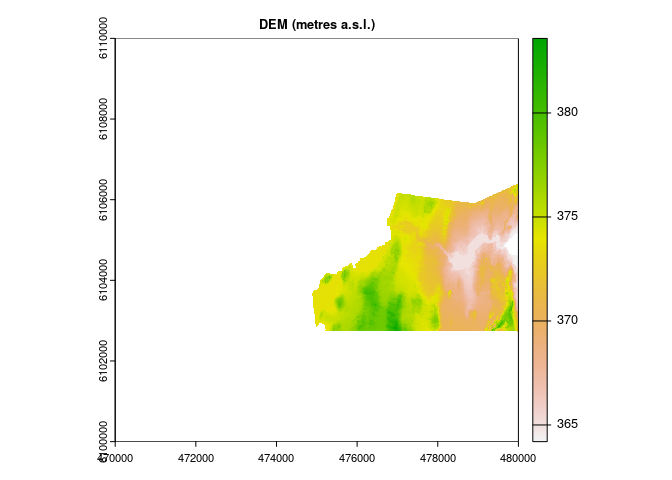
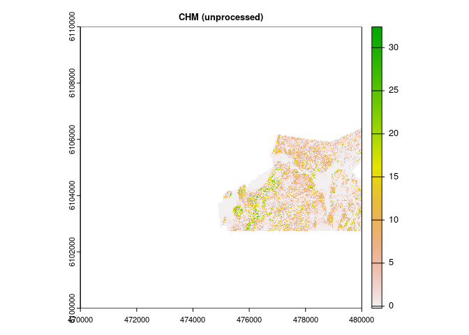
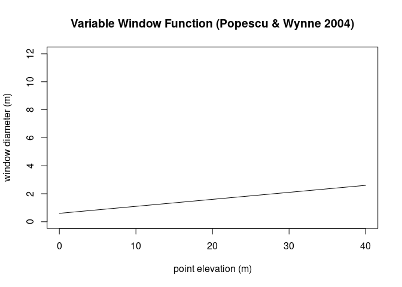
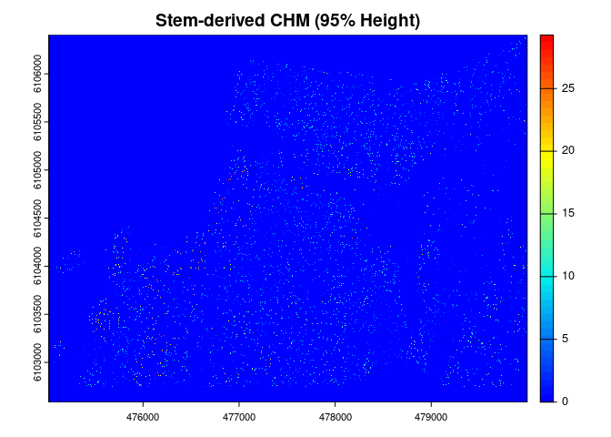
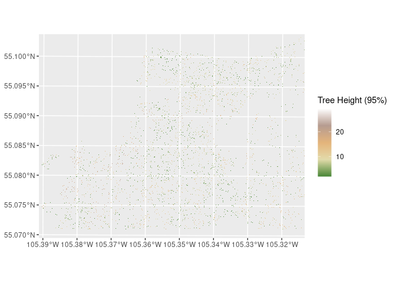
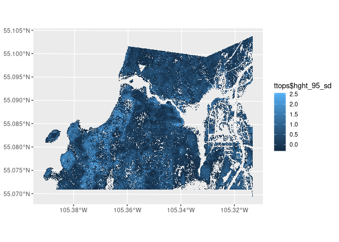
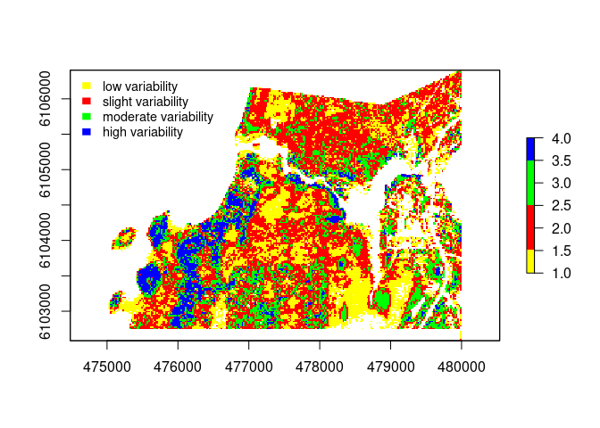

La Ronge Tree Heights
================
SMurphy
2023-10-15

- [Tree Height Variability](#tree-height-variability)
  - [Data Source](#data-source)
  - [Tree top detection](#tree-top-detection)
  - [Validation](#validation)
  - [High Height Heterogenity Areas](#high-height-heterogenity-areas)
    - [References](#references)

# Tree Height Variability

We apply the “Height Variation Hypothesis” and associated methods to
estimate tree height heterogeneity (MacArthur and MacArthu, 1961). Due
to varied factors regarding yield class, soil moisture, browsing,
species diversity, stocking density, line of sight and clinometer
errors, tree height variability presents a key challenge to upholding
accuracy targets in forest inventory operations. The following tool aims
to assist inventory crews to identify areas of high tree height
heterogeneity, where there may be need for an increase in number of
sample plots or for a decrease in the size of sampling units. Using
LiDAR derived tree metrics, we classify forest areas according simple
standard deviation values of tree height to produce maps of Height
Heterogeneity Areas, or HHA’s.

## Data Source

A digital surface model and digital elevation model were acquired in
raster form and with 1m resolution from the HRDEM repository for the La
Ronge surrounding area, as shown in the following location:
<https://open.canada.ca/data/en/dataset/957782bf-847c-4644-a757-e383c0057995/resource/83300867-10b0-4c9d-a2b6-3921f2a07dcb#additional-info>

``` r
dsm = raster::raster("/media/seamus/USB1/la_ronge/dsm_la_ronge.tif", select = 'xyzcr', filter = '-drop_class 19')
dem = raster::raster("/media/seamus/USB1/la_ronge/dem_la_ronge.tif", select = 'xyzcr', filter = '-drop_class 19')
dsm_sr = terra::rast(dsm)
dem_sr = terra::rast(dem)
chm_sr = dsm_sr - dem_sr
chm = raster::raster(chm_sr)
plot(dsm_sr, main="DSM (metres a.s.l.)", cex.main=0.8)
plot(dem_sr, main="DEM (metres a.s.l.)", cex.main=0.8)
plot(chm_sr, main="CHM (unprocessed)", cex.main=0.8)
```



## Tree top detection

We adopt below Popescu and Wynne’s function (2004) which was developed
in pine forests to define a variable window filter for detecting tree
tops. This is to account for stand variance across dominant,
co-dominant, intermediate, and suppressed trees, which present varying
heights and varying crown widths. We assume taller trees have wider
crowns. Therefore, we apply a simple linear function (wf_Popescu) to
adapt the radius of the search window according to canopy height. With
more resources available, a local radius to height curve can be derived
from the site’s dominant allometry.

To exclude low-lying underbrush or other spurious treetops, the variable
window function is also set with a minimum height of 2 m using the
minHeight argument as follows.

``` r
kernel <- matrix(1,3,3)
wf_Popescu<-function(x){ 
  a=0.05
  b=0.6 
  y<-a*x+b 
  return(y)}
heights <- seq(0,40,0.5)
window_Popescu <- wf_Popescu(heights)
plot(heights, window_Popescu, type = "l", ylim = c(0,12), xlab="point elevation (m)", ylab="window diameter (m)", main='Variable Window Function (Popescu & Wynne 2004)')
```

<!-- -->

To improve algorithm performance, we apply a smoothing operation to our
DSM raster. With cells softened, we then apply the upside-down watershed
algorithm from the ForestTools package, shown as vwf below. Outputs are
then converted from simple features to derive 95% height raster and stem
point shapefile in ESRI format using a custom function.

``` r
chm_smooth = focal(chm, w = kernel, fun = median, na.rm = TRUE) 
ttops = ForestTools::vwf(CHM = chm_smooth, winFun = wf_Popescu, minHeight = 2)
ttops$height_95 = ttops$height * 0.95 #avoid re-runs
ttops$height_95_sd = (ttops$height_95 - sd(ttops$height_95))/10
sf::st_write(ttops, "/media/seamus/USB1/la_ronge/chm_la_ronge.shp")
chm_ttops = stars::st_rasterize(ttops %>% dplyr::select(height_95, geometry))
chm_ttops_stdev = stars::st_rasterize(ttops %>% dplyr::select(height_95_sd, geometry))
stars::write_stars(chm_ttops, "/media/seamus/USB1/la_ronge/chm_ttops_raster.tif")
stars::write_stars(chm_ttops_stdev, "/media/seamus/USB1/la_ronge/chm_ttops_stdev.tif")
chm_ttops_raster = raster::raster("/media/seamus/USB1/la_ronge/chm_ttops_raster.tif")
chm_ttops_stdev = raster::raster("/media/seamus/USB1/la_ronge/chm_ttops_stdev.tif")
chm_ttops_spatRast = terra::rast(chm_ttops_raster)
chm_stdev_spatRast = terra::rast(chm_ttops_stdev)

plot(chm_ttops_spatRast, 
     col = height.colors(50), 
     main="Stem-derived CHM (95% Height)")

chm_ttops_spatRast[chm_ttops_spatRast == 0] <- NA
chm_ttops_raster[chm_ttops_raster == 0] <- NA
ggplot() +
  geom_spatraster(data = chm_ttops_spatRast) +
  geom_spatraster_contour(data = chm_ttops_spatRast, breaks = seq(5, 30, 5)) +
  scale_fill_whitebox_c() +
  coord_sf(expand = FALSE) +
  labs(fill = "Tree Height (95%)")

ttops %>% as_tibble() %>% print(n=10)
ttops %>% rename(crownWidth = winRads)

ggplot() +
  geom_sf(data = ttops, aes(color = ttops$hght_95_sd), show.legend = "point", size = 0.05, shape = ".") +
    scale_fill_continuous(palette = "lajolla")
  labs(fill = "Tree Height (95%)")
```

    ## Reading layer `chm_la_ronge' from data source 
    ##   `/media/seamus/USB1/la_ronge/chm_la_ronge.shp' using driver `ESRI Shapefile'
    ## Simple feature collection with 351920 features and 5 fields
    ## Geometry type: POINT
    ## Dimension:     XY
    ## Bounding box:  xmin: 475020.5 ymin: 6102588 xmax: 479998.5 ymax: 6106404
    ## Projected CRS: +proj=utm +zone=13 +ellps=GRS80 +units=m +no_defs

    ## # A tibble: 351,920 × 6
    ##    treeID height crownWidth hght_95 hght_95_sd           geometry
    ##     <int>  <dbl>      <dbl>   <dbl>      <dbl>        <POINT [m]>
    ##  1      1  10.2       1.11     9.66      0.471 (479997.5 6106404)
    ##  2      2  13.0       1.25    12.3       0.736 (479988.5 6106400)
    ##  3      3   7.61      0.980    7.23      0.228 (479978.5 6106396)
    ##  4      4  15.9       1.39    15.1       1.01  (479970.5 6106392)
    ##  5      5  11.2       1.16    10.6       0.568 (479958.5 6106388)
    ##  6      6  10.9       1.15    10.4       0.545 (479970.5 6106388)
    ##  7      7   9.02      1.05     8.57      0.362 (479964.5 6106386)
    ##  8      8   9.02      1.05     8.57      0.362 (479965.5 6106386)
    ##  9      9   3.81      0.790    3.62     -0.133 (479990.5 6106386)
    ## 10     10   3.81      0.790    3.62     -0.133 (479991.5 6106386)
    ## # ℹ 351,910 more rows

    ## # A tibble: 351,920 × 6
    ##    treeID height winRads hght_95 hght_95_sd           geometry
    ##     <int>  <dbl>   <dbl>   <dbl>      <dbl>        <POINT [m]>
    ##  1      1  10.2    1.11     9.66      0.471 (479997.5 6106404)
    ##  2      2  13.0    1.25    12.3       0.736 (479988.5 6106400)
    ##  3      3   7.61   0.980    7.23      0.228 (479978.5 6106396)
    ##  4      4  15.9    1.39    15.1       1.01  (479970.5 6106392)
    ##  5      5  11.2    1.16    10.6       0.568 (479958.5 6106388)
    ##  6      6  10.9    1.15    10.4       0.545 (479970.5 6106388)
    ##  7      7   9.02   1.05     8.57      0.362 (479964.5 6106386)
    ##  8      8   9.02   1.05     8.57      0.362 (479965.5 6106386)
    ##  9      9   3.81   0.790    3.62     -0.133 (479990.5 6106386)
    ## 10     10   3.81   0.790    3.62     -0.133 (479991.5 6106386)
    ## # ℹ 351,910 more rows





## Validation

Results are validated using tree-ID and crown segmentation. These steps
check for double-counting and overlapping edges.

``` r
crown_segment = itcSegment::itcIMG(chm_ttops_spatRast,epsg=2957)
summary(crown_segment)
plot(crown_segment,axes=T)
```

## High Height Heterogenity Areas

Using the simple structural diversity index developed by MacArthur and
MacArthur (1961), we derived structural diversity classes according to
height heterogeneity. Targeting height heterogeneity areas (HHA’s),
classes showing highest standard deviation were highlighted below in
blue.

Further metrics may consider combining horizontal estimates from within
and between sampling units, as well as crown width heterogeneity in
areas where there higher concentrations of wolf and veteran trees. Here
we simply rely on raster cell boundaries against population mean as a
quick fix.

``` r
print(chm_ttops_stdev)
```

    ## class      : RasterLayer 
    ## dimensions : 3816, 4979, 18999864  (nrow, ncol, ncell)
    ## resolution : 1, 1  (x, y)
    ## extent     : 475020, 479999, 6102588, 6106404  (xmin, xmax, ymin, ymax)
    ## crs        : +proj=utm +zone=13 +ellps=GRS80 +units=m +no_defs 
    ## source     : chm_ttops_stdev.tif 
    ## names      : chm_ttops_stdev

``` r
reclass_df <- c(-0.13, 0.1, 1,
                0.1, 0.4, 2,
                0.4, 0.6, 3,
                0.6, Inf, 4)

reclass_m <- matrix(reclass_df,
                ncol = 3,
                byrow = TRUE)

chm_classified <- reclassify(chm_ttops_raster,
                     reclass_m)

plot(chm_classified,
     col = c("yellow", "red", "green", "blue"))
legend("topright",
       legend = c("low heterogeneity", "slight heterogeneity", "moderate heterogeneity", "HHAs"),
       fill = c("yellow", "red", "green", "blue"),
       border = FALSE,
       bty = "n",
       cex=0.5) # turn off legend border
```

<!-- -->

### References

MacArthur, R. H., & MacArthur, J. W. (1961). On bird species diversity.
Ecology, 42(3), 594-598.

Popescu, S. C., & Wynne, R. H. (2004). Seeing the trees in the forest.
Photogrammetric Engineering & Remote Sensing, 70(5), 589-604.

Torresani, M., Rocchini, D., Alberti, A., Moudrý, V., Heym, M.,
Thouverai, E., & Tomelleri, E. (2023). LiDAR GEDI derived tree canopy
height heterogeneity reveals patterns of biodiversity in forest
ecosystems. Ecological Informatics, 76, 102082.
