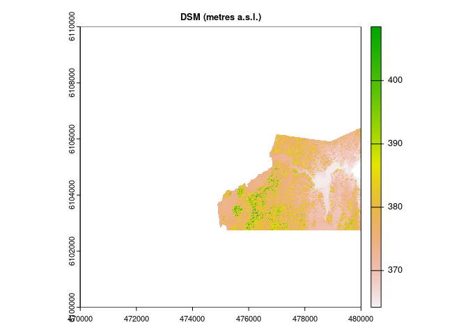

La Ronge Tree Heights
================
SMurphy
2023-10-15

- [Data Source](#data-source)

## Data Source

A digital surface model was acquired in raster form with 1m resolution
from the HRDEM repository for La Ronge surrounding area in the following
location:
<https://open.canada.ca/data/en/dataset/957782bf-847c-4644-a757-e383c0057995/resource/83300867-10b0-4c9d-a2b6-3921f2a07dcb#additional-info>

``` r
dsm = raster::raster("/media/seamus/USB1/la_ronge/dsm_la_ronge.tif", select = 'xyzcr', filter = '-drop_class 19')
plot(dsm)
```

<!-- -->
